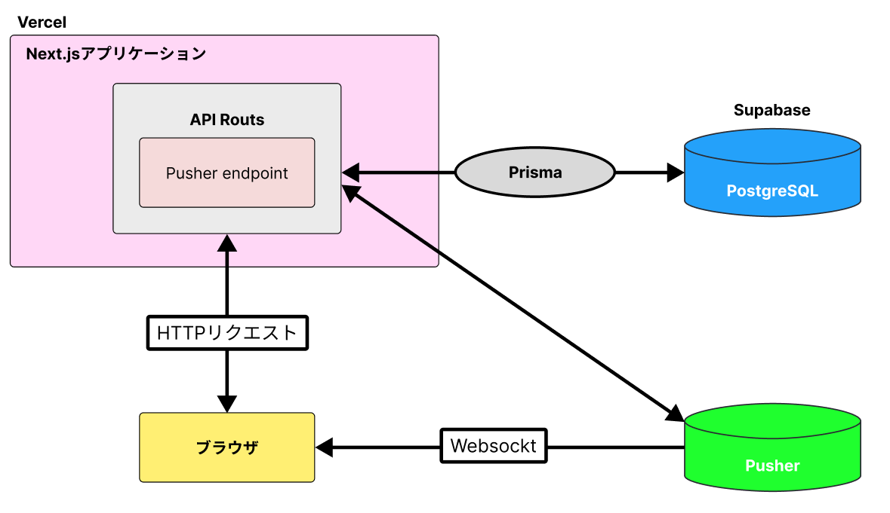
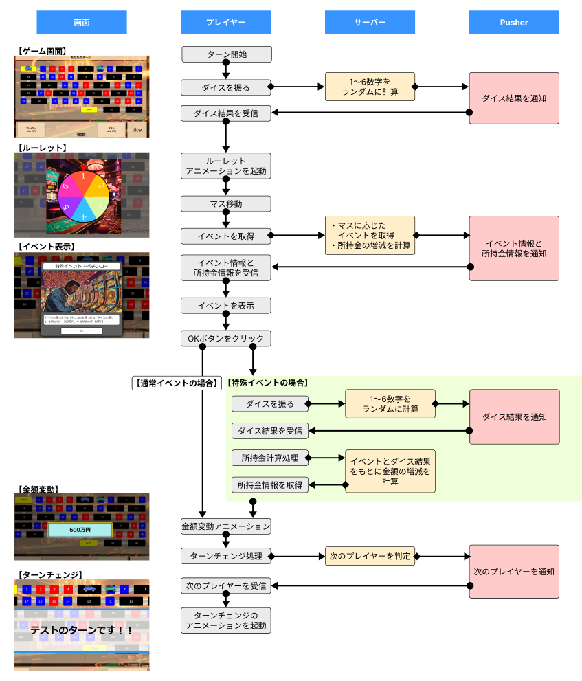
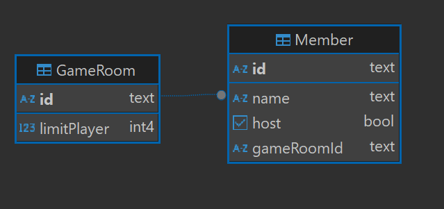

# リアルタイム通信人生ゲーム

このアプリは、ユーザーが複数人でリアルタイムに楽しめる人生ゲームを提供します。

## アプリURL

[人生ゲーム：https://life-game-app.vercel.app/](https://life-game-app.vercel.app/)

※サーバーを止めている場合があります。

## デモプレイ動画

以下のリンクから、ゲームの進行や特徴的な部分が紹介されたデモプレイ動画をご覧いただけます。

[デモプレイ動画：https://youtu.be/z3_Vemq-GnE](https://youtu.be/z3_Vemq-GnE)

## アプリ概要

- WebSocket（Pusher）を活⽤し、リアルタイム通信によるマルチプレイ可能な人生ゲームの開発。

## 使用技術

|                |                                   |
| -------------- | --------------------------------- |
| 言語           | HTML, CSS, JavaScript, TypeScript |
| フレームワーク | Next.js(13), Jest                 |
| ライブラリ     | React(18)                        |
| ツール・その他 | Git,Github, Visual Studio Code ,Figma      |
| リアルタイム通信  | Pusher                               |
| インフラ  | Vercel                               |

## 技術選定理由

- React・・・コンポーネントと状態管理で、複雑なロジックを簡潔に実現でき、リアルタイム通信での頻繁なUI更新（例: プレイヤーの位置更新、イベント発生時の画面変更）でも、効率的に差分のみをレンダリングできるためパフォーマンスが高いと判断しReactを選定しました。
- Next.js・・・フロントエンドの学習をメインで行っていたため、API Routsを使用して簡単にバックエンドを実装できることからNextJsを選定しました。また、Vercelにデプロイをしてみたいという理由から相性のいいNextJsを選定しました。
- Jest・・・フロントエンドフレームワーク（例: Next.js）とも親和性が高く、簡単に組み込めるため選定しました。
- Pusher・・・Vercelではサーバーレス環境が主流であることと、アプリが小規模のため、常時稼働するWebSocketサーバーを別途立てるのは非効率でコストが高いため、手軽に実装できるPusherを選定しました。

## 構成図

## ゲームロジック図

## ER図

このアプリのDBはルーム情報のみを管理しています。
各マスのイベント情報については、DBではなくファイルに定数として管理しており、ゲーム中の通信を減らすために、定数としてイベント情報を管理しています。
ＥＲ図の下にイベントデータのデータ構成を示します。

### イベントデータ構成

<pre>
{
  id: '1', //マスの位置をIDとする
  event: {
    id: '001',
    event_type: 'plus',
    title: '新たな人生の始まり',
    overview:　//イベントの内容
      'これから始まる新たな人生。とりあえず会社を辞めておくか。全員、退職金として300万受け取る。',
    src: 'event-0.png',
    value: 300,  
    special_event: {
      id: '1',
      conditions: ['1-3', '4-6'],
      effect_type: '+-',
      effect_value: [300, -50],
      base_amount: [0, 1],
    },
  },
},
</pre>

### 【データ説明】

#### ・event

- event_type：イベントマスの種類（plus,minus,specialの3種類）
- overview：イベントの内容
- src：イベントの画像パス
- value：event_typeがplus/minusの時はこの値を使い所持金を計算する。specialの場合は0とし、special_eventの内容を適応する。

#### ・special_event

- conditions：サイコロの出目の判定範囲。 例）サイコロが1~3が出たときのイベントの場合　'1-3'　のように記述することで判定する。
- effect_type：所持金が倍率で変動するか足し引きで変動するかを設定。 倍率の時は「"*/"」,足し引き時は「"+-"」とする。
- effect_value：conditionsの配列の位置と同じ位置で紐づいている。 effect_typeが「"*/"」の時は、倍率を設定。 「"+-"」の時は増減する値を設定する。
- base_amount：特殊イベントの内容に所持金の半分を賭けや、500万円を賭けなどが存在する。このベースとなる値をここで設定する。 所持金をベースにするときは０を設定することで現在の所持金を使用し計算する。 実数を設定すると、その金額を所持金から引いた形で計算を行う。 なお、配列の2番目の値はベースとなる金額に掛ける値を設定する。

## コード規約

[コード規約のリンク](./.github/coding-guidelines.md)
